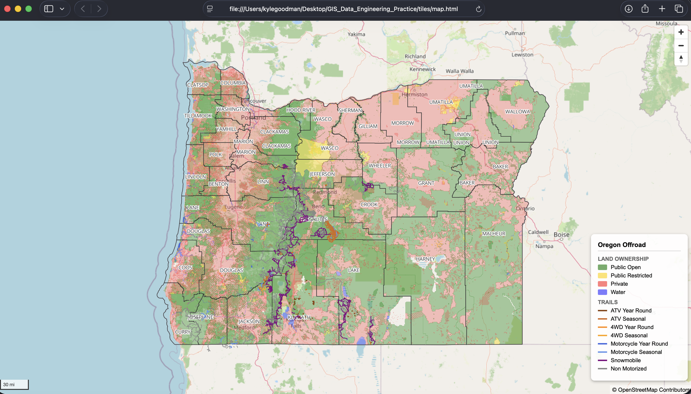

# GIS Data Engineering Practice

A personal project building an end-to-end geospatial data pipeline 
focused on motorized trail access, public land ownership, and 
off-road route planning for Oregon.

## Purpose
To develop hands-on experience with a professional GIS and data 
engineering stack used by recreation based technology companies working 
with large-scale spatial datasets. Built to practice:
- Spatial ETL pipeline development
- Cloud and local database management
- Vector tile generation and web map rendering
- Automated QA workflows
- Full stack GIS from raw source data to interactive web map

## Stack
| Tool | Purpose |
|------|---------|
| PostgreSQL + PostGIS | Local spatial database via Docker |
| Google BigQuery | Cloud data warehouse and spatial analytics |
| Python (GeoPandas, SQLAlchemy) | Pipeline automation and data ingestion |
| QGIS | Desktop visualization and visual QA |
| GDAL/ogr2ogr | Spatial data format conversion |
| Tippecanoe | Vector tile generation |
| Martin | Local vector tile server |
| MapLibre GL JS | Web map rendering |
| GitHub | Version control and documentation |

## Data Sources
| Dataset | Source | Features |
|---------|--------|----------|
| Oregon Counties | Oregon GeoHub REST API | 36 counties |
| USFS Trails | USFS ArcGIS REST API | 8,522 trails |
| Oregon Land Ownership | Oregon GeoHub REST API | 3,266 features |

## Pipeline Architecture

**1. Ingest** — Python scripts fetch from REST APIs with pagination and retry logic

**2. Raw Storage** — PostGIS raw tables preserve source data exactly as received

**3. Transform** — SQL cleans, renames, and filters into clean schema tables

**4. QA** — Automated geometry and attribute checks + visual review in QGIS

**5. Cloud** — BigQuery loads for cloud-scale spatial analytics

**6. Tiles** — GDAL exports to GeoJSON → Tippecanoe generates .pmtiles

**7. Web Map** — Martin tile server → MapLibre GL JS renders in browser

## QA Approach
This pipeline uses a two-layer QA approach:

**Automated QA** — `pipelines/qa_unsupervised.py` checks:
- Row counts against expected values
- Null and invalid geometries
- Null values in critical fields
- Features outside expected geographic extent

**Visual QA** — QGIS review of PostGIS layers before tile generation,
checking for spatial accuracy, symbology correctness, and contextual issues
that automated checks cannot catch.

## Known Data Issues
- 843 trails with null `terra_motorized` field (missing classification)
- 2,685 trails outside Oregon extent (Washington region overlap)
- 469 invalid land ownership geometries (source data slivers)

## Project Structure
- `data/` — raw and processed spatial datasets (not tracked by Git)
- `sql/` — schema, enrichment, and QA queries
- `pipelines/` — Python ingestion, transformation, and QA scripts
- `bigquery/` — BigQuery load scripts and practice queries
- `qgis/` — QGIS project files
- `tiles/` — vector tile generation scripts and web map
- `docs/` — notes, learning journal, and images

## Stack Progress
- ✅ GitHub — repo, structure, version control
- ✅ BigQuery — dataset, geospatial queries, spatial joins, data loaded
- ✅ Docker + PostGIS — PostgreSQL 17 + PostGIS 3.5
- ✅ Python — virtual environment, geospatial libraries, pipeline scripts
- ✅ Data Ingestion — 3 datasets from REST APIs with pagination and retry
- ✅ Data Transformation — clean schema tables with documented QA findings
- ✅ QGIS — rule-based symbology for motorized trails and land ownership
- ✅ BigQuery — all three datasets loaded to cloud
- ✅ Vector Tiles — Tippecanoe + Martin + MapLibre GL JS web map
- ✅ Automated QA — geometry, attribute, and extent checks

## Future Steps
- ◻️ Supervised QA - Look for data anomalies, reconcile boundary overlaps, clean map annotations, add basemap selection, etx
- ◻️ Reconcile all noted QA issues
- ◻️ Push .pmtiles to cloud storage for staging with engineering team
- ◻️ Create data dictionary
- ◻️ Add/Schedule run_pipeline.sh script to periodically update data

## Map Preview (Prior to QA)
